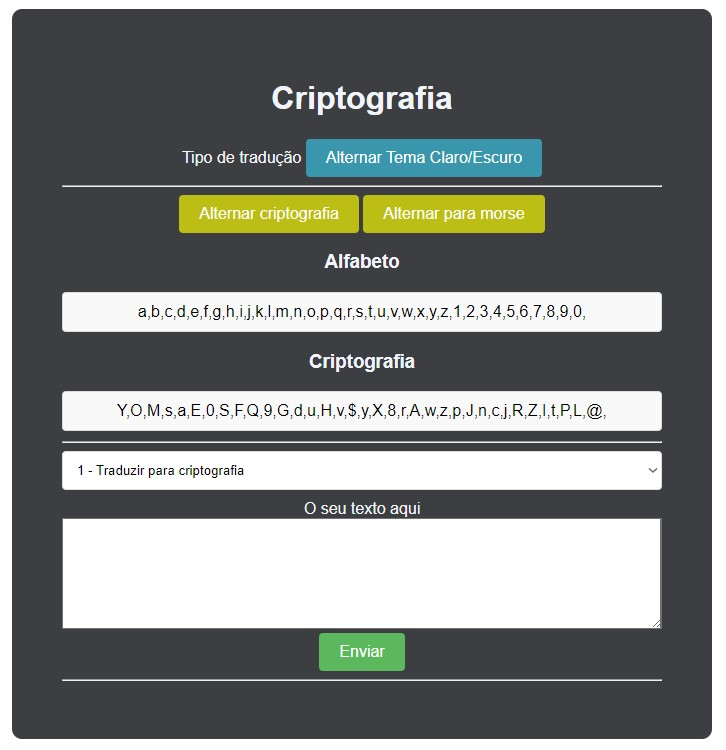
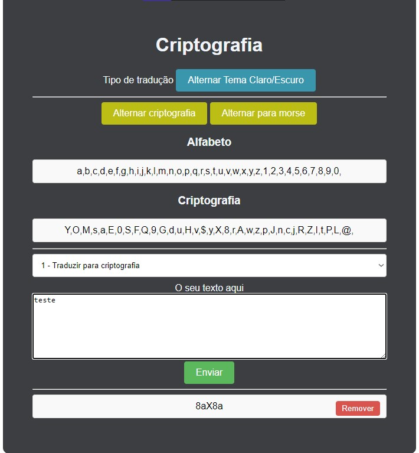

# Converter
Converter for cryptography and morse.
# Tela inical do projeto
()

Este conversor gera e traduz criptografias, ele não quebra criptografias, apenas trabalha embaralhando e traduzindo de acordo com a criptografia por ele predefinida.
O sistema é composto por (1 Alternar Tema Claro/Escuro), (2 Alternar criptografia), (3 Alternar para morse), (4 Alfabeto), (5 Criptografia), (6 Traduzir para criptografia), (7 O seu texto aqui), (8 Enviar), (9 Campo de resultados), (10 Remover).

# Tela inical do projeto
()

(1)=Altera o tema do projeto para claro ou escuro.
(2)=Gera uma nova criptografia, o sistema abandona a antiga e usa a mais recente.
(3)=Troca para o tipo de criptografia morse.
(4)=Mostra o alfabeto para comparação do usuário.
(5)=Mostra a criptografia para comparação do usuário.
(6)=Um select para alternar entre qual tipo de tradução desejar, escholhe entre criptografar e descriptografar.
(7)=Área onde usuario pode colocar o testo.
(8)=Botão que envia a mensagem para o sistema traduzir.
(9)=Campo onde aparecem os resultados.
(10)=Botão que remove resultados.